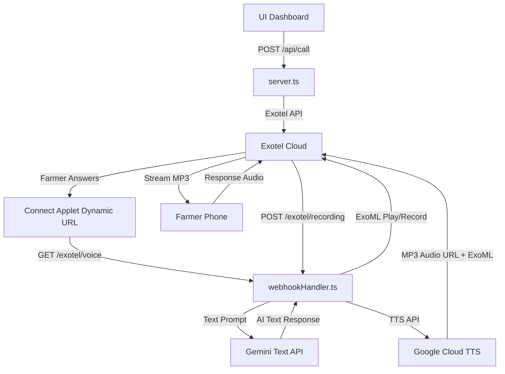

# Project Flow — Deepak Fertilisers AI Calling Agent

## End-to-End Call Flow

### Phase 1: Call Initiation

```
UI Dashboard
  │
  ├── User enters: phone, customer name, language, agent gender
  ├── Clicks "Call Customer"
  │
  ▼
POST /api/call
  │
  ├── callStarter.ts → Exotel REST API → creates outbound call
  ├── callContext.ts → stores {name, phone, product, language, agentGender}
  └── Returns callSid to frontend
```

### Phase 2: Exotel Connection & Webhook

```
Exotel dials farmer
  │
  ├── Farmer picks up
  ├── Exotel routes call to Connect Applet (App ID: 1188866)
  ├── Connect Applet fetches dynamic URL → GET/POST /exotel/voice
  │     └── webhookHandler.ts → Returns ExoML (XML):
  │         <Response><Play>https://ngrok.../audio/greeting.mp3</Play><Record.../></Response>
  │
  └── Exotel streams greeting & records farmer response
```

### Phase 3: Conversation Flow Engine

```
Conversation State Initialized
  │
  ├── sessionMap loaded for incoming callSid
  ├── System instruction built for Gemini
  │     (Language, gender, products)
  │
  └── Waiting for Exotel recording callbacks
```

### Phase 4: Turn-Based Conversation

```
┌─────────────────────────────────────────────────┐
│              Conversation Loop                   │
│                                                  │
│  Farmer speaks → Exotel records → Webhook        │
│  Webhook → conversationFlow.ts → Gemini          │
│  Gemini Text → TTS → MP3 → ExoML → Exotel        │
│                                                  │
│  Transcript tracked in:                          │
│  - session.transcript (for UI context)           │
│  - UI broadcast via /ui-sync WebSocket           │
│                                                  │
│  Agent follows 8-step call flow:                 │
│  1. Greeting & verification                      │
│  2. Consent gate                                 │
│  3. Need discovery (crop/disease/product)        │
│  4. Product recommendation (smart skip)          │
│  5. Order capture (product → qty → address)      │
│  6. Order confirmation                           │
│  7. SMS + payment link                           │
│  8. Closure                                      │
└─────────────────────────────────────────────────┘
```

### Phase 5: Order & SMS (Real-Time)

```
User speaks: "दोन पिशव्या 19:19:19 आणि एक स्मारटेक"
  │
  ├── orderExtractor.ts detects quantities + products via LLM prompt
  │     └── Updates context.items Map: { "NPK 19-19-19": 2, "Mahadhan Smartek": 1 }
  │
  ├── Agent says "SMS पाठवतो" or "पेमेंट लिंक"
  │
  ├── saveOrder() → orderStore.ts
  │     └── Calculates total using productCatalog.ts (fuzzy match)
  │     └── Generates order ID (DF-XXXX-1001)
  │
  └── sendOrderSms() → smsService.ts → Exotel SMS API
        ├── Builds itemized bill
        ├── Adds Hardcoded Payment Link (https://amrutpeth.com/...)
        └── Fire-and-forget (non-blocking)
```

### Phase 6: Call Closure

```
Agent speaks closing line ("धन्यवाद! शुभ दिवस!")
  │
  ├── conversationEndDetector.ts detects closing phrase
  ├── System returns <Hangup/> in ExoML response to Exotel
  └── Exotel ends call
```

---

## Smart Behavioral Rules

### Product Skip
| Input | Behavior |
|-------|----------|
| "मला खत हवं आहे" | Ask crop → recommend product |
| "मला NPK 19-19-19 पाहिजे" | **Skip crop** → ask quantity |
| "दोन पिशव्या महाधन अमृता" | **Skip crop + quantity** → ask address |

### Address Capture
| Input | Behavior |
|-------|----------|
| Full address given | Accept → move to confirmation |
| Only village given | Ask: तालुका? → जिल्हा? → पिनकोड? |
| "हो" without address | Ask: गाव? → तालुका? → जिल्हा? → पिनकोड? |

### Domain Guard
| Input | Behavior |
|-------|----------|
| Crop/fertiliser questions | Answer (in-domain) |
| Disease symptoms | Recommend product |
| "Are you AI?" / general knowledge | Polite redirect |
| Abuse / DND | End call gracefully |

---

## Data Flow Diagram


    E -->|Transcript via /ui-sync| A
    E -->|Order Extraction| I[orderExtractor.ts]
    I -->|SMS Trigger| J[smsService.ts]
    J -->|Exotel SMS API| G
```
